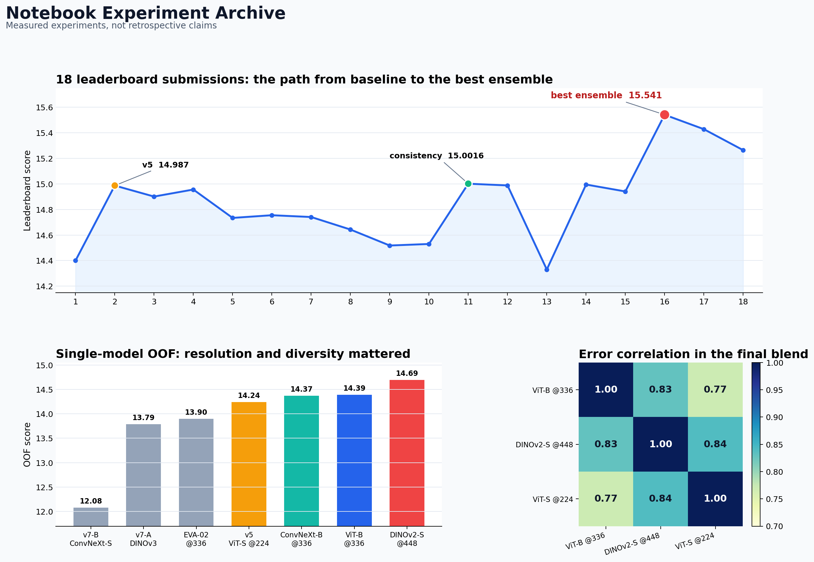

# Notebook Experiment Archive

> Архив экспериментов: от первого multi-view baseline до лучшей проверенной сборки с результатом **15.541**.

[](submissions/final_15541.csv)
[](docs/EXPERIMENTS.md)
[](docs/EXPERIMENTS.md)
[](notebooks/README.md)

Здесь сохранены не только финальный код и лучший сабмит, но и история решений: какие гипотезы проверялись, что сработало, что оказалось тупиком и какие технические ошибки пришлось найти по дороге.



## Быстрый маршрут

| Если нужно | Открыть |
|---|---|
| Понять решение за 5 минут | этот README |
| Увидеть все 18 отправок и измерения | [журнал экспериментов](docs/EXPERIMENTS.md) |
| Разобрать архитектуру, данные и выводы | [технический отчёт](docs/SOLUTION_REPORT.md) |
| Посмотреть финальную сборку | [`notebooks/sber_v7.ipynb`](notebooks/sber_v7.ipynb) |
| Запустить обучение трёх веток с нуля | [`notebooks/sber_v8.ipynb`](notebooks/sber_v8.ipynb) |
| Проверить источник сильнейшей модели @448 | [`dino448_s2_source.ipynb`](notebooks/archive/dino448_s2_source.ipynb) |
| Сравнить отправленные предсказания | [`submissions/`](submissions/) |

## Задача

Для каждого 3D-меша нужно предсказать 11 бинарных меток: десять дефектов и `quality` — отсутствие дефектов.

```text
score = 10 * F1(quality) + 10 * F1_weighted(10 defect classes)
```

Данные объединяют два канала: геометрию меша (`.npz` с вершинами и гранями) и лист из шести рендеров 1536×1024. В train 8964 объекта, в test — 669.

## Финальное решение

Лучший сабмит — логит-ансамбль трёх моделей с разными разрешениями и не полностью совпадающими ошибками:

| Источник | Архитектура | Tile | OOF | Вес |
|---|---|---:|---:|---:|
| `vitb336` | DINOv2 ViT-B/14 | 336 | 14.39 | 0.75 |
| `dino448_s2` | DINOv2 ViT-S/14 Reg4 | 448 | 14.69 | 1.00 |
| `v5_224` | DINOv2 ViT-S/14 | 224 | 14.24 | 0.50 |

После смешивания применяются точные F1-пороги и согласование разметки: если объект предсказан как плохой, но ни один дефект не прошёл порог, добавляется наиболее вероятный дефект по отношению `p / threshold`.

Архитектурно каждая ветка получает шесть ракурсов, общий визуальный бэкбон и ML-Decoder. Параллельно MLP обрабатывает 235 геометрических, топологических, силуэтных и CLIP-признаков.

## Хронология

| # | Версия | Что изменили | Вложенная | Лидерборд |
|---:|---|---|---:|---:|
| 1 | Базовая | Multi-view DINOv2 ViT-S/14 @224 + CLIP + GBM + стекинг + powerset | 14.274 | 14.400 |
| 2 | **v5** | Самопересечения, качество треугольников, non-manifold; `asl_weight` 0.50 → 0.65 | 14.124 | **14.987** |
| 3 | Post-processing | Бэггинг правила, глобальные веса, `quality` по головам моделей | 14.290 | 14.901 / 14.956 |
| 4 | Пороги по доле | Квантильные пороги вместо абсолютных | — | 14.734 |
| 5 | v7 | DINOv3 + кросс-вью трансформер + soft-F1 + EMA | 14.317 | 14.755 |
| 6 | v7 ensemble | DINOv3 + v5 + второй уровень | 14.690 | 14.643 |
| 7 | v9 | ViT-B/14 @336, ML-Decoder, симметрии стенда | ~14.5 | 14.518 |
| 8 | **Consistency** | «Плохому» объекту без дефектов добавляется наиболее вероятный дефект | — | **15.0016** |
| 9 | **Ensemble 3** | `vitb336 + dino448_s2 + v5_224`, веса `0.75 / 1.00 / 0.50` | **14.855** | **15.541** |
| 10 | Состав ансамбля | Замена `v5_224` на ConvNeXt-B | 14.916* | 15.264 |
| 11 | Пересборка | Исправление маски покрытия: 7154 объекта вместо 7156 | 14.853 | 15.366 |

\* Оценка 14.916 посчитана только на 5384 объектах и поэтому не сопоставима напрямую с 14.855 на покрытии 7156.

Полная таблица 18 отправок, OOF одиночных моделей, диагностики сдвига, per-class F1 и сравнение вариантов `quality` находятся в [EXPERIMENTS.md](docs/EXPERIMENTS.md).

## Что оказалось решающим

**Разрешение.** Один ракурс исходно имеет около 512 px. Переход 224 → 336 → 448 дал одиночным моделям 14.24 → 14.39 → 14.69.

**Разнообразие ансамбля.** Корреляции ошибок финальной тройки — 0.77–0.84. Единственный крупный скачок, `+0.54` на лидерборде, получен объединением трёх комбинаций «бэкбон + разрешение».

**Согласование меток.** Простое доменное тождество `quality = 1 ⇔ нет дефектов` дало 14.987 → 15.0016. Более агрессивные варианты согласования ухудшали результат.

**Честная оценка.** Решающее правило настраивается на четырёх фолдах и оценивается на пятом. Такая вложенная схема показала переобучение обычной OOF-оценки до 0.35 балла.

## Что не сработало

| Гипотеза | Измеренный результат |
|---|---|
| DINOv3 сильнее DINOv2 | 13.79 против 14.24 |
| EVA-02 даст разнообразие | два фолда из пяти схлопнулись |
| Второй уровень улучшит CNN | 14.317 против 14.329 у чистого CNN-бленда |
| Квантильные пороги устойчивее | 14.734 против 14.987 |
| Отдельная модель улучшит `quality` | лучшая отдельная схема 0.7104 против 0.7233 у среднего логитов голов |
| Спектр Лапласа поможет геометрии | 27 часов расчёта, вклад около нуля |
| ConvNeXt-B заменит старый v5 в ансамбле | 15.264 против 15.541 |

## Почему мы не оптимизировали по лидерборду

Тест содержит только 669 объектов. Бутстрап одной и той же модели дал `14.404 ± 0.384`, 95% интервал `[13.61, 15.15]`. Разница двух близких отправок меньше примерно 0.8 балла статистически ненадёжна.

Гипотеза о train/test shift также не подтвердилась: классификатор «train против test» по 235 признакам дал AUC `0.502`.

## Структура репозитория

```text
.
├── README.md                    # короткая витрина проекта
├── assets/                      # графики для README и презентации
├── docs/
│   ├── EXPERIMENTS.md           # полный журнал измерений
│   └── SOLUTION_REPORT.md       # подробный технический разбор
├── notebooks/
│   ├── sber_v1.ipynb ... sber_v8.ipynb
│   └── archive/                 # контрольные и альтернативные сборки
├── submissions/
│   ├── v5_14987.csv
│   └── final_15541.csv
└── scripts/                     # статическая проверка и идентификация весов
```

## Воспроизводимость

- ноутбуки и CSV проверены на корректный JSON/схему;
- seed и 5-fold multilabel split зафиксированы;
- веса и многогигабайтные кэши в Git не включены;
- `vitb336` и `v5_224` сохранились как fold-предсказания, но их исходные checkpoints были удалены ранней логикой `drop_ckpt`;
- `final_15541.csv` — точный эталон отправки с результатом 15.541;
- `dino448_s2_source.ipynb` фиксирует фактическую конфигурацию сильнейшего источника: ViT-S/14 Reg4, tile 448, 16 эпох, LR `4e-5`, layer decay `0.75`.

Репозиторий документирует фактически выполненные эксперименты. Там, где полного воспроизведения без внешних кэшей или весов нет, это отмечено явно.
